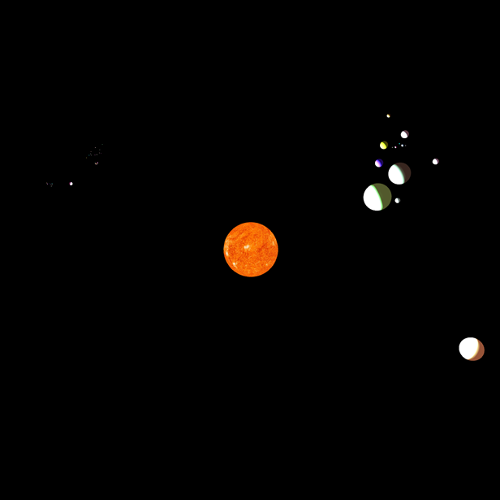
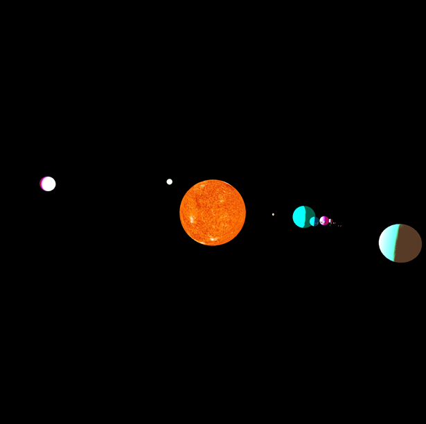
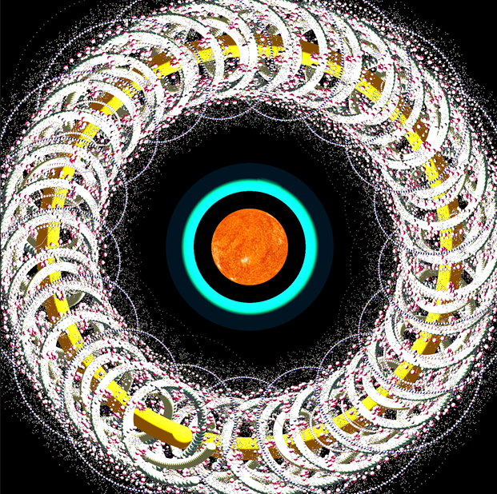
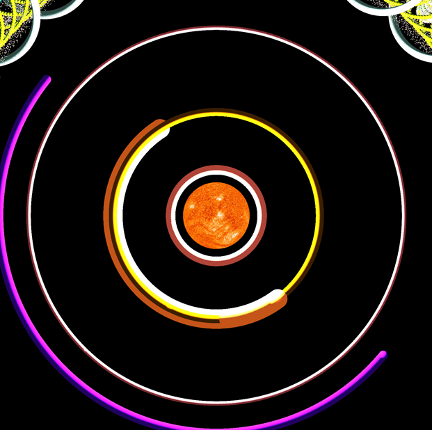

# Solar System

## Table of Contents

- [Solar System](#solar-system)
  - [Table of Contents](#table-of-contents)
  - [Description](#description)
    - [Display](#display)
      - [Examples](#examples)
    - [Folder structure](#folder-structure)
    - [Programming language(s)](#programming-languages)
  - [Installation](#installation)
  - [Usage](#usage)
    - [Invocation](#invocation)
    - [Operation](#operation)
  - [Contributions](#contributions)

## Description

This program generates a random solar-system animation.  
Start date: 2019-09-16  
Current version: 0.1.0  

### Display

#### Examples

### Folder structure

| Tree with Root Having Local Path | Generation Method | Description |
| -------------------------------- | ----------------- | ----------- |
| <https://github.com/anderjef/Solar_System> | auto-generated by Processing | <!-- --> |
| [.github/](.github/) | <!-- --> | holds GitHub-specific documents |

### Programming language(s)

- Processing (Java)
  - [Solar_System.pde](Solar_System.pde)&mdash;main program entrance sets up canvas and executes animation steps
  - [Planet.pde](Planet.pde)&mdash;defines Planet class
  - [Star.pde](Star.pde)&mdash;defines Star class

## Installation

- Download [ZIP](https://github.com/anderjef/Solar_System/archive/main.zip). Extract to a folder named Solar_System.
- Download and install [Processing 4.0 beta 1 or compatible](https://processing.org/download). Please understand that Processing may have bugs of its own.
- Open any of the Processing Source Code files with the Processing IDE (PDE).
- Install the PeasyCam library (within the Processing environment).

## Usage

### Invocation

- See [Installation](#installation).
- Run the code from within the Processing IDE or export the application first (exporting requires copying [starTexture.jpg](starTexture.jpg) into the executable's folder).

### Operation

Click and drag the display to rotate the camera. Scroll to zoom. Press the spacebar to toggle whether the black, space background is redrawn each frame.

## Contributions

- Jeffrey Andersen&mdash;developer
- [YouTube The Coding Train Video 1](https://www.youtube.com/watch?v=l8SiJ-RmeHU), [YouTube The Coding Train Video 2](https://www.youtube.com/watch?v=dncudkelNxw), and [YouTube The Coding Train Video 3](https://www.youtube.com/watch?v=FGAwi7wpU8c)&mdash;inspiration

For copyright, license, and warranty, see [LICENSE.md](LICENSE.md).
